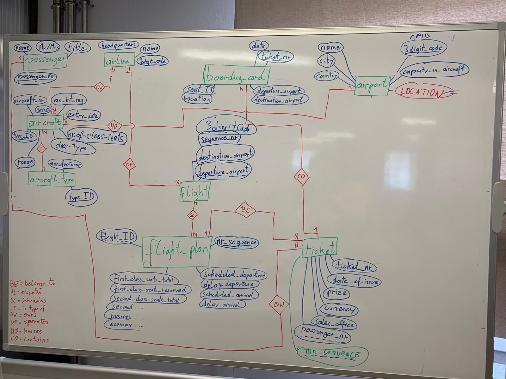
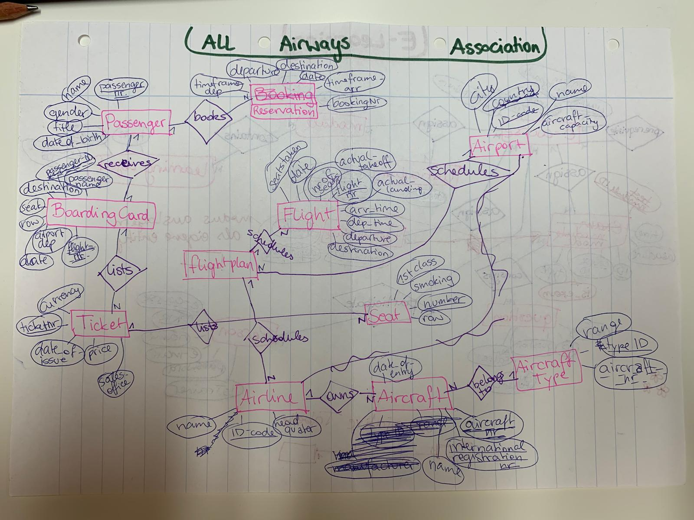
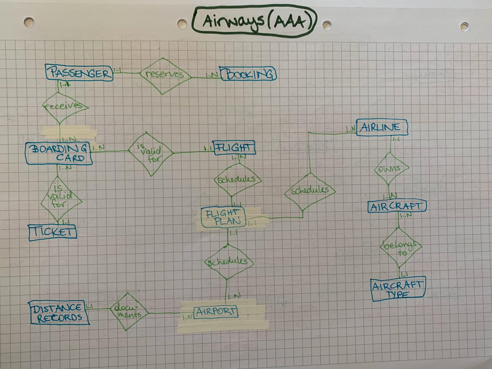

# AirwaysERM

The All Airways Association (AAA) is an association that brings together all airlines. This association plans to install a comprehensive information system for flight handling. An initial survey produces the following situation report:
When a passenger (passenger number, name, Mr/Mrs, title, etc.) wants to book a flight (or several), he or she first specifies the desired departure and destination airports, the desired flight date and possibly also a time frame when he or she wants to fly away or arrive.
There are various airlines (name, headquarters, etc.) that operate flights. Airlines are identified by a code of maximum three digits (e.g. PA for PanAm, FUA for Futura Air). Each airline operates aircraft (aircraft number, international registration number, name, date of entry into service, etc.) of different aircraft types (type identification, manufacturer, range, etc.).
The airports (name, city, country, capacity in aircraft, etc.) are also encrypted with a three-digit code (e.g. VIE for Vienna-Schwechat, JFK for New York - John F. Kennedy, IBZ for Ibiza). The distances between airports must be recorded in order to be able to take the range of the aircraft type into account when drawing up the flight plan.
Each flight has a departure airport and an arrival airport, the flights are numbered consecutively with a three-digit number within a company. (e.g. PA039 between VIE and JFK, FUA916 between IBZ and VIE) Each flight has a fixed scheduled departure and arrival time, and the days on which the flight takes place are also specified. (e.g. daily for scheduled flights, daily except Sat and Sun, weekly Mon, and the individual days for charter flights). The number of seats available in each class is determined in advance for each flight, the number of remaining free seats must also be determined on an ongoing basis. The flights booked by the passenger are summarized on one ticket (ticket number, date of issue, price, currency, sales office, etc.)
Before starting the flight, the passenger will be given a boarding card at the airport, on which in addition to the flight number, date, departure airport, destination airport and name of the passenger, the allocated seat
(row as number, seat as letter, e.g. 18D) and a smoking or non-smoking license plate appears. The non-smoking seats are assigned on each flight starting from the front of the aircraft, the smoking seats starting from the rear. Seating arrangements depend on the type of aircraft on which the flight is performed. For each seat the class (First Class 1 Economy) and location (window, aisle, middle) are
to hold on to.
For each flight, it must also be possible to record the actual take-off and landing time in order to be able to make evaluations of the punctuality of individual flights.

## ER-Model Teamwork

## Relational Model Teamwork

* Passenger (**passenger_ID:int**, first_name:varchar(20), last_name:varchar(20), salutation:varchar(5), title:varchar(20), phone:varchar(32), email:varchar(32))
* Booking (**booking_nr:int**, departure:varchar(3), destination:varchar(3), flight_date:date, departure_time:time, arrival_time:time)
* Flight (**flight_ID:int**, departure:varchar(3), destination:varchar(3), departure_time:time, arrival_time:time)
* Flight Schedule (**schedule_ID:int**, *flight_ID:int*, date:date, daily:boolean, weekly:boolean, )
* Airline (**airline_ID:int**, name:varchar(20), headquater:varchar(20), city:varchar(20))
* Aircraft (**aircraft_nr:int**, registration_nr:int, name:varchar(20), entry_into_service:date)
* Aircraft Type (**type_ID:int**, manufacturer:varchar(23), range:double)
* Airport (**airport_ID:int**, name:varchar(25), city:varchar(20), country:varchar(20), aircraft_capacity:int)
* Distance Records (**records_ID:int**, airport1:int, airport2:int, distance:double)

## ER-Model

### Version 2:

## Relational Model (updated to version 2)

* Passenger (**passenger_id:int**, first_name:varchar(20), last_name:varchar(20), salutation:varchar(5), title:varchar(10))
* Flight (**flight_id:varchar(10)**, *flight_plan_id:int*, departure_airport:char(3), arrival_airport:char(3), departure_time:timestamp, arrival_time:timestamp, seats_available_first:int, seats_available_business:int, seats_available_economy:int, actual_departure:time, actual_arrival:time)
* Flight Plan (**flight_plan_id:int**, flight_date:date, departure_time:timestamp, arrival_time:timestamp, is_weekly:boolean, is_daily:boolean, on_weekdays:boolean)
* Booking (**booking_id:int**, *passenger_id:int*, departure_airport:char(3), destination_airport:char(3), flight_date:date, departure_time:time, arrival_time:time)
* Airline (**airline_id:varchar(3)**, *flight_plan_id:int*, company_name:varchar(32), headquarters:varchar(32))
* Aircraft (**registration_nr:int**, *airline_id:varchar(3)*, *type_id:int*, aircraft_nr:int, designation:varchar(32), entry_into_service:date)
* Aircraft Type (**type_id:int**, manufacturer:varchar(32), aircraft_range:double, max_capaxity:int)
* Airport (**airport_id:char(3)**, *records_id:int*, *flight_plan_id:int*, airport_name:varchar(30), city:varchar(20), country:(20), aircraft_capacity:int)
* Distance Records (**records_id:int**, departure_airport:char(3), destination_airport:char(3), distance:double)
* Ticket (**ticket_nr:int**, date_of_issue:date, price:double, currency:varchar(10), sales_office:varchar(32), num_of_flights:int)
* Boarding Card (**boarding_card_id:int**, *passenger_id:int*, *ticket_nr:int*, *flight_id:varchar(10)*, departure_date:date, departure_airport:char(3), destination_airport:char(3), first_name:varchar(20), last_name:varchar(20), seating_row:int, seat:char(1), class:varchar(10), location:varchar(10))

## Airways SQL Schema

